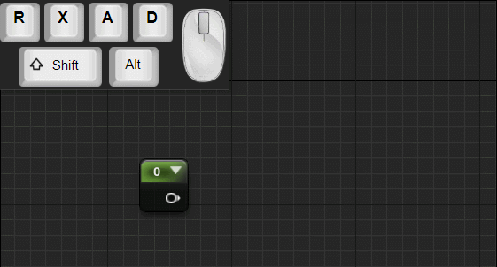
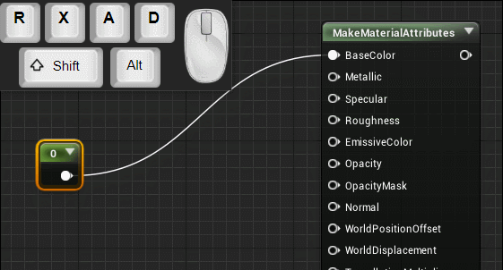
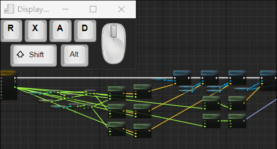
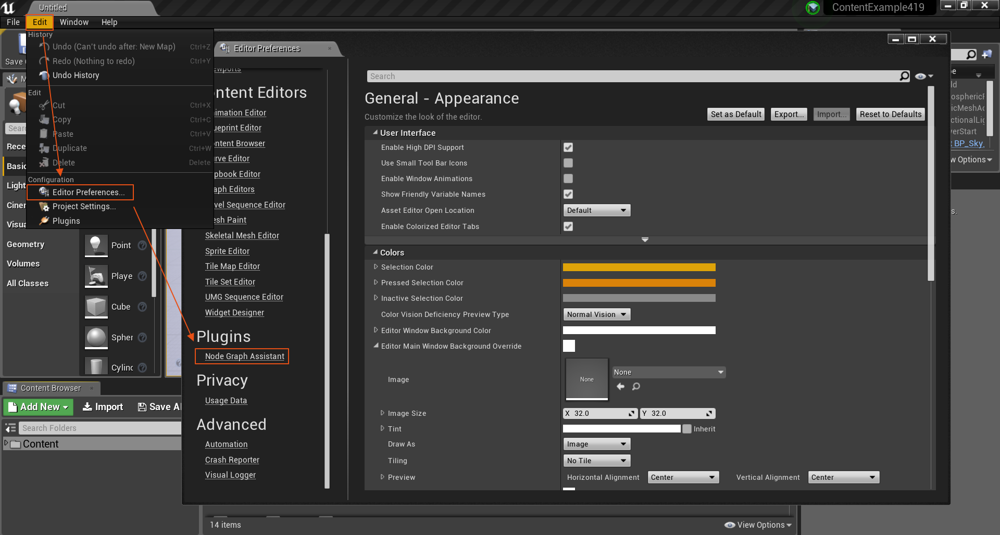

# UE4-Node-Graph-Assistant User Guide

Support page: https://forums.unrealengine.com/unreal-engine/marketplace/1435240-node-graph-assistant  
Marketplace page: https://www.unrealengine.com/marketplace/node-graph-assistant  
中文说明：https://github.com/pdlogingithub/UE4-Node-Graph-Assistant/blob/master/Doc/%E8%99%9A%E5%B9%BB4%E8%93%9D%E5%9B%BE%E5%8A%A9%E6%89%8B%E4%BD%BF%E7%94%A8%E8%AF%B4%E6%98%8E.md  

1. Right click multi-connect: Panning is unlock when dragging a wire,right click on pin to multi-connect,right click on panel to cancel.  

2. Left click multi-connect: Click on pin to start free panning,zooming and multi-connecting.  

3. Shift click multi-connect: When dragging a wire, hold down shift to start free panning,zooming and multi-connecting.  

4. Dupli-wire: Shift click or drag on pin to duplicate wire.  

5. Rearrange nodes: Press <kbd>Alt</kbd>+<kbd>R</kbd> to rearrange nodes, most suitable for small block of nodes.   

6. Bypass node: Press <kbd>Alt</kbd>+<kbd>X</kbd> will remove selected nodes on wire.  

7. Create node on wire: Right click on wire to create node on wire.  

8. Highlight wire: Left click to highlight wire, hold down shift to highlight multiple wires, middle mouse double click on pin to highlight all connected wires.  

9. Cutoff wires: Hold <kbd>Alt</kbd> and drag across wires to break them.  

10. Select linked nodes: Middle mouse double click on a node to select all connected nodes.  
Depending on whether the left or right area of the node is clicked on, this will select all children or all parents.  
Or use the hotkey <kbd>Alt</kbd>+<kbd>A</kbd>, or <kbd>Alt</kbd>+<kbd>D</kbd>.  

11. Lazy connect: When dragging off of a pin, the wire will snap to the closest pin on the hovered node.  
Hold <kbd>Shift</kbd> while dragging to connect multiple wires.

 
12. Auto connect: When moving a node, its pins will align to surrounding connectible pins. Releasing mouse will commit connections.  
Holding <kbd>Alt</kbd> will suppress auto connect.   

13. Wire style: press the toolbar button to cycle through wire styles.  

14. Shake node off wire: Shake a node quickly while dragging to bypass this node from wires.  

15. Duplicate with inputs: Duplicate selected nodes and keep input wires with <kbd>Alt</kbd>+<kbd>V</kbd>  

16. Insert node on wire:  

17.  Exchange wires: Exchange two sets of wires with <kbd>Alt</kbd>+<kbd>T</kbd>  

Go to the editor preferences to see more settings.

  
  
  
